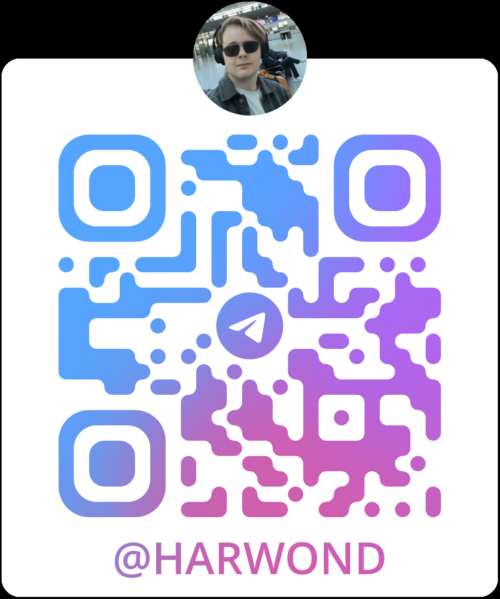

# AI Face Recognition
AI-модуль проекта Multi Tools отвечает за распознавание лиц и генерацию
биометрических эмбеддингов для студентов. Он вынесен в отдельный FastAPI-сервис
и используется фронтендом и backend-сервисом для сценариев посещаемости.

## Назначение
Модуль решает две основные задачи:
1. Получить embedding лица по загруженному изображению.
2. Распознать студента по изображению или через поток с камеры.
В актуальной архитектуре основной backend может хранить эмбеддинги студентов в
PostgreSQL через pgvector, а AI-сервис отвечает за вычисление самого embedding.
Также в AI-модуле остается локальный режим распознавания через файл
`ai/data/embeddings.npy`.

## Технологии
- FastAPI - HTTP API для интеграции с backend и frontend.
- Uvicorn - запуск ASGI-сервера.
- OpenCV - чтение изображений, обработка кадров с камеры и подготовка crop лица.
- YOLOv8 / ultralytics - поиск человека/лица на кадре.
- FaceNet / facenet-pytorch - генерация embedding лица размерностью 512.
- NumPy и PyTorch - работа с векторами и cosine similarity.
- Matplotlib - служебные визуализации без GUI-режима.

## Архитектура модуля
```
ai/
├── main.py                         # FastAPI-сервис и основные endpoints
├── generate_embeddings.py          # Генерация локальной базы embeddings.npy
├── backend_integration.py          # Вспомогательная отправка результата в backend
├── test_camera.py                  # Проверка камеры
├── pyproject.toml                  # Poetry-зависимости AI-сервиса
├── requirements.txt                # Альтернативный список зависимостей
├── detection/
│   └── yolo_detector.py            # Обертка над YOLOv8
├── recognition/
│   ├── facenet_model.py            # Обертка над FaceNet
│   └── matcher.py                  # Простой matcher по cosine distance
├── utils/
│   ├── compare_faces.py            # Поиск лучшего совпадения по cosine similarity
│   ├── image_tools.py              # Вспомогательные функции для изображений
│   ├── log_similarity.py           # Логирование similarity
│   └── visualize_embeddings.py     # Визуализация embeddings
└── ai/data/
    ├── embeddings.npy              # Локальная база эмбеддингов
    ├── faces_db/                   # Фото пользователей для локальной базы
    └── yolo_models/yolov8n.pt      # Весовая модель YOLO
```

## Основной pipeline
1. Клиент отправляет изображение на AI-сервис.
2. FastAPI endpoint читает файл и декодирует его через OpenCV.
3. `YoloDetector` находит области с человеком/лицом.
4. Берется самая крупная найденная область.
5. Crop приводится к размеру `160x160` и RGB-формату.
6. `FaceEmbedder` строит embedding через FaceNet.
7. Сервис возвращает embedding или сравнивает его с локальной базой.

## Endpoints

### `GET /status`
Возвращает состояние AI-сервиса:
- `status` - доступность сервиса;
- `camera_status` - работает ли камера;
- `face_detected` - было ли найдено лицо в текущей сессии.
### `POST /embedding`
Принимает изображение в поле `file` и возвращает embedding лица.
Используется backend-сервисом для сохранения биометрии студента в базе данных.
Если лицо не найдено или embedding не построен, возвращается статус ошибки:
`no_face`, `invalid_bbox`, `invalid_crop` или `embedding_failed`.
### `POST /recognize_from_image`
Принимает изображение в поле `file`, строит embedding и сравнивает его с локальной
базой `ai/data/embeddings.npy`.
Ответ содержит:
- `username` - найденный пользователь или `Unknown`;
- `similarity` - значение cosine similarity;
- `status` - `recognized`, `not_recognized` или технический статус ошибки.

### `POST /check_attendance_use_ai`
Запускает фоновое распознавание через камеру. Сервис открывает камеру,
обрабатывает кадры ограниченное время и сохраняет результат в памяти процесса.

### `GET /get_recognition_result`
Возвращает результат последнего распознавания через камеру. Если пользователь
распознан, сервис дополнительно обращается к backend:
```
http://localhost:8000/api/get_student_information/{username}
```
и возвращает `user_id` студента.
### `POST /reset_recognition`
Останавливает активную сессию распознавания и сбрасывает состояние сервиса.
## Интеграция с backend
Backend использует AI-сервис через настройку `AI_SERVICE_URL`, по умолчанию:
```
http://localhost:8002
```
Основной актуальный сценарий:
1. Backend получает фото студента.
2. Backend отправляет файл на `POST /embedding`.
3. AI-сервис возвращает embedding.
4. Backend сохраняет embedding в `StudentFaceImage.embedding`.
5. При распознавании backend снова получает embedding от AI-сервиса.
6. Backend ищет ближайший embedding в PostgreSQL через pgvector и cosine distance.
Такой подход лучше масштабируется, чем локальный файл `embeddings.npy`, потому что
биометрия студентов хранится вместе с остальными данными проекта.
## Локальная база embeddings.npy
Файл `ai/data/embeddings.npy` используется для автономного режима AI-сервиса:
- распознавание через `POST /recognize_from_image`;
- распознавание через камеру;
- тестовые сценарии без обращения к базе backend.
Чтобы пересоздать локальную базу, добавьте изображения пользователей в:
```
ai/data/faces_db/<user_id>/
```
и запустите:
```bash
python generate_embeddings.py
```
После этого будет создан или обновлен файл:
```
ai/data/embeddings.npy
```

## Запуск
Через Poetry:
```bash
cd ai
poetry install
poetry run python main.py
```
Или напрямую, если зависимости уже установлены:
```bash
cd ai
python main.py
```
Сервис запускается на:
```
http://localhost:8002
```

## Важные замечания
- Для корректной работы нужен файл модели `ai/data/yolo_models/yolov8n.pt`.
- FaceNet автоматически использует CUDA, если доступна видеокарта с поддержкой
  PyTorch CUDA, иначе работает на CPU.
- Камера в `main.py` открывается через `cv2.VideoCapture(1)`. Если устройство не
  найдено, может потребоваться заменить индекс камеры на `0`.
- CORS в AI-сервисе настроен на frontend `http://localhost:5173`.
- Порог распознавания в локальном режиме задается константами
  `SIMILARITY_THRESHOLD`, `HIGHER_SIMILARITY_THRESHOLD` и `CONFIDENCE_SAMPLES`.

## Поддержка
Если возникли вопросы, обратитесь к документации или свяжитесь с разработчиком в Telegram: @HaRwonD

